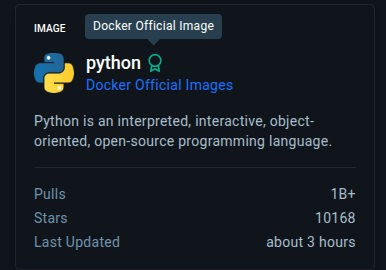

# Crie ambientes Reais com Docker e dê fim ao "na minha máquina funciona"
## Sumário 
- [Apresentação aula 1](#1-crie-ambientes-reais-com-docker-e-dê-fim-ao-na-minha-máquina-funciona)
- [Introdução](#2-introdução)
- [Links Uteis](#3-links-uteis)
- [Ativando créditos da Cloud](#4-ative-seus-créditos-da-google-cloud)
- [Mergulhe mais fundo](#5-mergulhe-mais-profundo)
- [Notações sobre a aula](#6-notações-da-aula)
  - [Utilizando o Docker](#61-utilizando-o-docker)
---
## 1. Crie ambientes Reais com Docker e dê fim ao "na minha máquina funciona"
### Participe e vá mais fundo 
Chegou a hora de mergulhar na Imersão Cloud DevOps da Alura e do Google Cloud! Em poucos dias, você vai dominar os princípios do DevOps e começar a criar e implantar seus próprios projetos com foco em práticas reais de DevOps. Cada aula desta imersão foi pensada para você colocar a mão na massa e aprender do jeito certo vamos nessa?  
__MARVEL__

[Link do projeto inicial](https://github.com/guilhermeonrails/ellis)  
[Link do projeto final](https://github.com/guilhermeonrails/refactored-octo-chainsaw/tree/aula_1)

---
## 2. Introdução 
Nesta primeira aula, você vai aprender a trabalhar com contêineres utilizando Docker, preparando o ambiente ideal para aplicar conceitos de CI/CD. Também vamos explorar como a inteligência artificial pode ajudar na documentação e otimização de processos com Gemini Code Assist.  
### Nesta aula, você vai 
- Criar uma imagem Docker de uma aplicação simples (como uma API em Python).
- Entender e resolver o clássico problema do "na minha máquina funciona". 
- Aprender o que são contêineres e como funcionam as imagens Docker. 
- Executar aplicações localmente via Docker Run e Docker-Compose. 
- Construir suas próprias imagens personalizadas usando um Dockerfile. 
- Utilizar o Docker compose para uma orquestração básica de múltiplos serviços. 

--- 
## 3. Links Uteis
- [Começando com Docker](https://www.alura.com.br/artigos/comecando-com-docker)
- [Acesse o Guia de Mergulho](https://grupoalura.notion.site/Imers-o-Cloud-DevOps-Guia-de-Mergulho-207379bdd09b80bc91c2f67f3c69332a?source=copy_link?utm_source=guiademergulhoguiademergulho&utm_campaign=imersao-devops_engajamento)
---
## 4. Ative seus créditos da Google Cloud
### Siga o passo a passo abaixo:
Confira este tutorial que preparamos para você: [aqui](https://www.youtube.com/watch?v=UVjJW8JL4Tk&feature=youtu.be)  
- Acesse [este link](https://trygcp.dev/e/20250701-sotgbsa)
- __Faça login__: Utilize o endereço de E-mail @gmail.com. Você será redirecionado para uma nova página em que você terá que clicar no botão: __"Click here to access your credits".__  
- Conclua o cadastro: Na próxima página, você verá que o código do cupom já está preenchido. Caso seja necessários, adicione as informações solicitadas e clique em __"Aceitar e Continuar"__.  

__Pronto!__ Agora você já pode usar a plataforma Google Cloud para você colocar seu projeto e fazes seus testes!

## 5. Mergulhe mais profundo
- [Guia completo sobre a cultura DevOps para iniciantes](https://www.alura.com.br/artigos/o-que-e-devops)
- [Docker: Desvendando o DockerFile](https://www.alura.com.br/artigos/desvendando-o-dockerfile)
- [Docker: Compose para compor uma aplicação](https://www.alura.com.br/artigos/compondo-uma-aplicacao-com-o-docker-compose)
- [Cloud: o que eé, História e Guia da computação em nuvem](https://www.alura.com.br/artigos/cloud)

---
## Divulgue seu projeto
Quem compartilha seus projetos ganha mais visibilidade no mercado! Poste seu progresso no LinkedIn e use a hashtag #imersao-cloud-devops para interagir com outros devs e até chamar atenção de recrutadores!

Estamos ansiosos para mergulhar em aprendizado junto com você! Bom mergulho e até a próxima aula.  

--- 
# 6. Notações Da aula
O Docker anteriormente era um projeto de código fechado e que se tornou OpenSource e meados de 2013, em que a ideia se apropriava de um conceito de Linux dos **Cgroups**, só que a ideia central seria realizar a separação, fazendo uma analogia com um S.O seria uma separação de arquivos de projeto tal qual é feito em pastas de um diretório, então é possível separar ali o que se quer de um projeto. O que diferencia o Docker de uma VM seria "mais pesada", devido a todas suas dependências, S.O, HyperVisor aplicativos "nativos", que não serão utilizados para o projeto em especifico o que acarreta em um peso maior para aplicação. Diferente desse contexto o Container se aplica pois ele além de ser menor, ele também poderá ser categorizado como "efêmero" ou seja ele pode "nascer e morrer" de e ainda assim continuar funcionado em sua "ressurreição", da mesma maneira para aquela aplicação. Em sua principal diferença se da a menor consumo de recursos. Conforme descrito na Web :
*"A principal diferença entre máquinas virtuais (VMs) e containers é o nível de abstração e isolamento que oferecem. VMs virtualizam todo o hardware de uma máquina, incluindo o sistema operacional, enquanto containers virtualizam apenas o sistema operacional, permitindo que várias aplicações compartilhem o mesmo kernel do sistema operacional host. Isso torna os containers mais leves, rápidos e eficientes em termos de recursos em comparação com as VMs."*
Então a Docker em DevOps e um popularizador da cultura __DevOps__, sendo elas portabilidade, flexibilidade, escalabilidade, "o poder levar a aplicação para onde quiser",  são premissas que foram popularizadas pelo Docker.  
Outra vantagem do Docker, e que em um cenário empresarial, o Docker resolve famigerado problema de "Na minha máquina", uma vez que o docker ajuda a potencializar como as aplicações podem utilizar os recursos providos pela nuvem de uma melhor maneira, pois uma vez que em docker se podemos classificar "trabalhar com menos recursos", a escalabilidade de um projeto não é prejudicada, pois não será preciso uma virtualização de um sistema operacional completo mais as dependências de projeto mais o projeto em si, fazendo somente o necessário para rodar aquele projeto, utilizando somente o conceito de __Servless__.

### 6.1 Utilizando o Docker 
O que é preciso fazer para tornar a aplicação, e melhorar a portabilidade para que se possa ser executada em outros sistemas. 
A priore será necessários um __Docker file__, que nada mais é que um arquivo de definição, do que será executado.  
Esse __Docker file__ é alguns comandos que diz ao docker o que será *"rodada"* quando esse container subir

Dentro do projeto, será criado um documento [Dockerfile](src/imersao-devops-main/Dockerfile), que conforme as boas práticas é escrito somente com "D" maiúsculo e sem extensão.  
Dentro do arquivo em questão em suma maioria toda vez que se for criar um arquivo Dockerfile, ele deverá vir de uma base `FROM`,essa base de imagens podem ter origens distintas de diversos repositórios, porém geralmente será *"buscado"* do `Dockerhub` (O maior repositório de imagens docker), é valido a se atender qual é o tipo de aplicaçãos que se esta trabalhando para buscar uma imagem compatível com o projeto. A imagem em questão conterá os arquivos/configurações minímas viáveis para para se "rodar" uma aplicação em Python como no caso, diferentemente de uma VM na qual teria todo um sistema virtualizado com o Python instalado no Docker essa imagem conterá somente o necessário para rodar a aplicação. 
__OBS:__ Dentro do docker hub sempre que se for "baixar" uma imagem do [Docker Hub](https://hub.docker.com/) e interessante ver as labels ao lado das imagens. Conforme imagem  </br>   </br>
Na imagem em questão e demonstrado um ícone de certificado nos indica que a imagem em questão trata-se de uma imagem confiável, pois a relação entre quantidade de downloads não implica diretamente na confiabilidade daquela imagem.  
Outro ponto e que ao acessar a imagem em si, nos será apresentados diferentes tamanhos de imagens serem baixadas, e em cada uma dessas imagens teremos diferentes características, no caso em questão a mais utilizada será a com terminologia de `aplpine`, em que a própria a caracteriza como "lareway", ou seja "a mais leve", é importante se atentar pois isso trata diferenças em tempo de inicialização do container. 

Ainda sobre a definição do __Docker file__  é indicado que sempre que possível consulte o [Dockerfile references](https://docs.docker.com/reference/dockerfile/), nessa pagina será demonstrado quais os tipos de tags utilizadas. 

Em outra perspectiva podemos utilizar de algum __Dockerfile__ já existente para **"não ter que criar do zero"** um novo __Dockerfile__, e o ajustar conforme necessidade. Para pesquisar ou gerar um docker file podemos tanto pesquisar na web como utilizar uma I.A tal qual o [Gemini](https://gemini.google.com/app), para gerar esse dockerfile. através da extensão Gemini Code Assist. 

Assim como o arquivo gitgnore em repositórios git o Docker possui um arquivo semelhante, no qual define para docker quais serão ou `não serão` os arquivos/diretórios que deverão ser "containerizados, através do arquivos .dockerignore, a utilização desse arquivo decorre das boas práticas para que faça que a imagem a ser utilizada no container seja mais enxuta e melhor utilizada, devido a diversos fatores utilizando da premissa de utilizar o mínimo necessário. 
após a criação do Dockerfile, podemos rodar o projeto com o código 
```
docker build -t sua-imagem.

```
Esse comando irá construir uma imagem do projeto onde o argumento -t corresponde a tag, e o `.` diz  qual é diretório será utilizado
Por fim podemos executar o código para rodar a aplicação no docker com 
```
docker run -p 5000:5000 sua-imagem

```
No casso esse comando é passado como argumento qual é o de para da porta local com a porta do docker, e qual é a imagem docker que será utilizada. 

--- 
<table style="text-align: center; width: 100%;">
  <caption><b>Skills do projeto </b></caption>
  
  <tr>
    <td style="text-align: center;">
      
    </td>
    <td style="text-align: center;">
      
    </td>
  </tr>
  
  <tr>
    <td colspan="2" style="text-align: center;">
      
    </td>
  </tr>
  
  <tr>
    <td style="text-align: center;">
      
    </td>
    <td style="text-align: center;">
      
    </td>
  </tr>

</table>

---
Titulo: 1 .Crie ambientes reais com Docker 

Autor: Thierry Lucas Chaves

Data criacao: 01/07/2025

Data modificacao: 02/07/2025

Versao: 1.0  

---